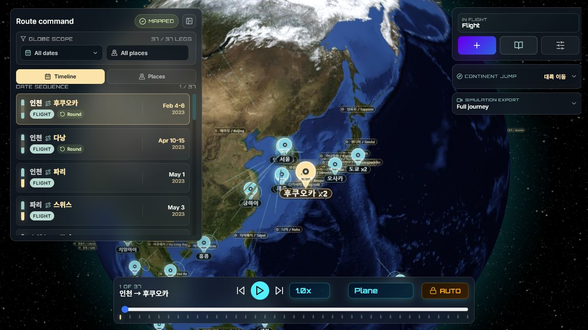
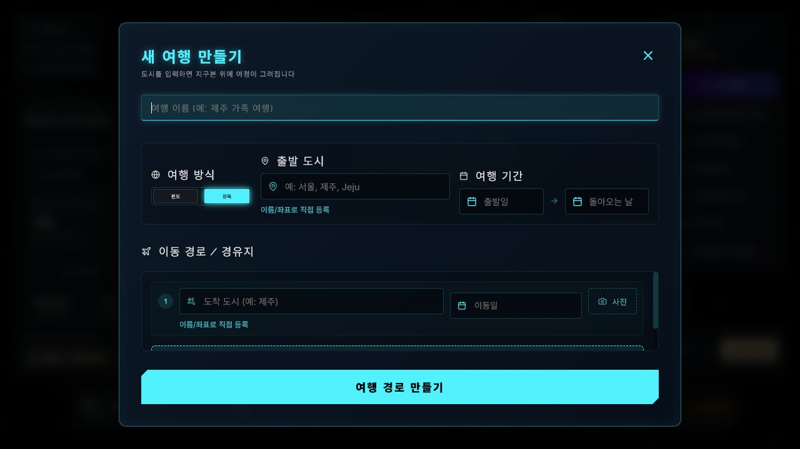
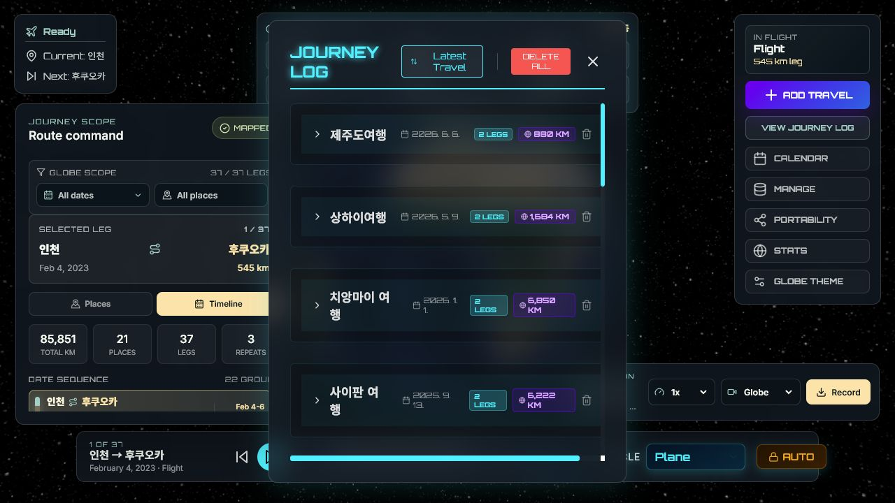
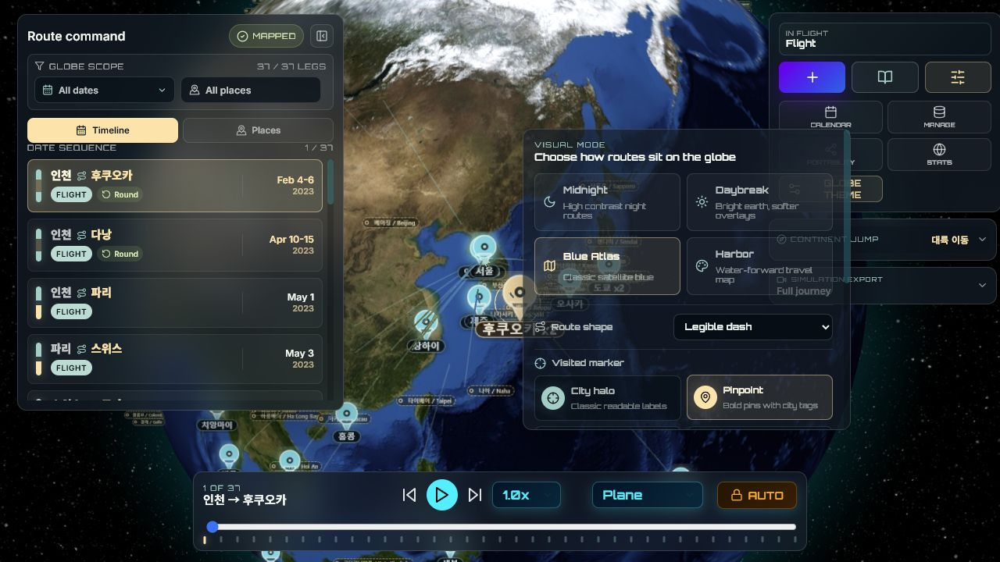

# VoyageAtlas

[English](README.en.md) · [설치/실행 가이드](docs/SETUP.ko.md)

VoyageAtlas는 사용자의 여행 기록을 3D 지구본 위에서 가장 아름답고 직관적으로 표현하기 위한 여행 아카이브 앱입니다.

여행을 `Odyssey` 단위로 등록하고, 도시 간 이동 경로와 사진, 영상, 파노라마 미디어를 하나의 지구본 경험으로 다시 볼 수 있습니다.
단순한 여행 목록이 아니라, 내가 지나온 도시와 이동 경로가 지구 위에서 연결되고 재생되는 개인 여행 지도입니다.

VoyageAtlas가 가장 중요하게 보는 경험은 두 가지입니다. 여행을 최대한 빠르게 기록할 수 있어야 하고, 기록된 여정은 다시 열었을 때 한눈에 이동의 흐름이 느껴져야 합니다.
그래서 메인 화면은 3D 글로브를 중심으로 구성되어 있으며, 등록·관리·재생·추천 여행지 탐색이 모두 지구본 경험 주변에서 이어집니다.

## 화면 미리보기

### 메인 글로브

여행 경로와 현재 이동 구간을 글로브 중심으로 확인합니다. 보조 도구, 대륙 이동, 시뮬레이션 내보내기는 접힌 상태로 시작해 화면을 덜 복잡하게 유지합니다.



### 시뮬레이션 재생

필터링된 여정을 지구본 위에서 재생하고, Globe/Aerial 시점의 시뮬레이션으로 내보낼 수 있습니다.


### Odyssey 등록

여행 이름, 출발 도시, 기간, 경유지를 입력하면 지구본 위에 표시할 이동 경로가 만들어집니다.



### Journey Log

등록된 여행을 최신순으로 확인하고, 각 Odyssey의 구간 수와 총 이동 거리를 빠르게 비교합니다.



### 글로브 테마와 추천 여행지

`TOOLS`를 펼친 뒤 글로브 스타일, 경로 표현 방식, 도시 마커, 추천 여행지 레이어를 조절해 여정을 더 보기 좋게 탐색합니다.



## 핵심 가치

- 여행 등록의 마찰을 줄인다.
- 등록된 여정을 지구 위에서 살아 움직이는 이야기처럼 보여준다.
- 기능보다 지구본 경험을 우선한다.

## 주요 기능

- **3D 지구본 여행 시각화**: 방문 도시, 이동 경로, 항공/선박/지상 이동 아크를 지구본 위에 표시합니다.
- **여정 재생**: 항공기, Starship, 선박, 기차, 차량 등 이동체가 경로를 따라 움직입니다.
- **Odyssey 관리**: 여러 도시와 구간으로 구성된 여행을 생성하고 Journey Log/Dashboard에서 관리합니다.
- **미디어 아카이브**: 사진, 영상, 360도 파노라마 이미지를 여행 이벤트에 연결합니다.
- **시뮬레이션 내보내기**: 필터링된 여정을 Globe/Aerial 시점의 영상으로 기록하고 다운로드합니다.
- **추천 여행지 레이어**: 아직 가보지 않은 세계 주요 도시와 휴양지를 `Global Top N` 또는 `Country Top N` 방식으로 표시합니다.
- **데이터 관리**: CSV 가져오기/내보내기와 로컬 데이터 관리 패널을 제공합니다.

## 빠른 실행

Docker Desktop을 실행한 뒤:

```powershell
.\scripts\start.ps1
```

macOS / Linux:

```bash
chmod +x scripts/start.sh
./scripts/start.sh
```

접속 주소:

- 앱: [http://localhost:3333](http://localhost:3333)
- API 문서: [http://localhost:8888/docs](http://localhost:8888/docs)
- MinIO 콘솔: [http://localhost:9991](http://localhost:9991)

자세한 설치, 실행 확인, 문제 해결은 [설치/실행 가이드](docs/SETUP.ko.md)를 참고하세요.

## 사용 흐름

1. `ADD TRAVEL`로 Odyssey를 생성합니다.
2. 출발지, 도착지, 날짜, 교통수단을 입력합니다.
3. 지구본에서 경로를 재생하고 카메라/속도/이동체를 조절합니다.
4. Journey Log나 Dashboard에서 사진, 영상, 파노라마를 업로드합니다.
5. `TOOLS`를 열어 Calendar, Manage, Portability, Stats, `GLOBE THEME` 같은 보조 도구를 필요할 때만 펼칩니다.
6. 대륙 이동이나 시뮬레이션 내보내기 패널을 접었다 펼치며 글로브를 넓게 유지합니다.
7. 필요한 범위를 필터링한 뒤 시뮬레이션 영상으로 내보냅니다.

## 아키텍처

```text
Docker Stack
├── Frontend  React / Vite   -> localhost:3333  (container: 5173)
├── Backend   FastAPI        -> localhost:8888  (container: 8000)
└── MinIO     S3-compatible  -> localhost:9999  (console: 9991)
```

## 기술 스택

- Frontend: React 18, Vite, react-globe.gl, Three.js, lucide-react, photo-sphere-viewer, Axios
- Backend: FastAPI, SQLAlchemy/SQLModel, SQLite, pandas, boto3, Pillow, geopy
- Infrastructure: Docker Compose, MinIO

## 프로젝트 구조

```text
VoyageAtlas/
├── backend/                 # FastAPI API, DB 모델, 미디어/지오코딩 유틸
├── frontend/                # React 앱, 글로브 UI, HUD, 모달, 추천 여행지 데이터
├── docs/                    # 설치/실행 문서
├── scripts/                 # 로컬 실행 helper
├── docker-compose.yml
└── README.md
```

## 개발 참고

- `API_BASE`는 `frontend/src/api/client.js`에서만 관리합니다.
- 글로브 렌더링은 `frontend/src/components/TravelGlobe.jsx`와 `frontend/src/utils/flightPhysics.js`가 중심입니다.
- 추천 여행지 데이터는 `frontend/src/config/worldHighlights.js`에 있습니다.
- 추천 여행지 필터링/정렬은 `frontend/src/utils/worldHighlightLayer.js`에서 처리합니다.
- 개발 환경의 SQLite DB는 스키마 변화에 따라 재생성될 수 있으므로 중요한 데이터는 export 후 작업하는 것이 안전합니다.

## 라이선스

이 프로젝트는 [Apache License 2.0](LICENSE)에 따라 배포됩니다.
